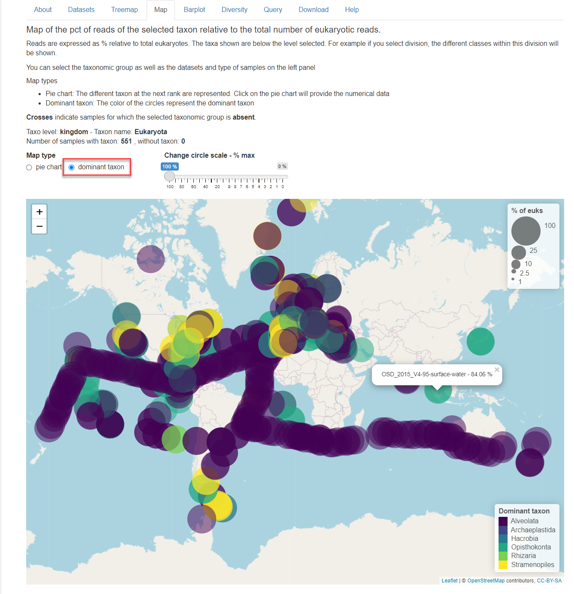
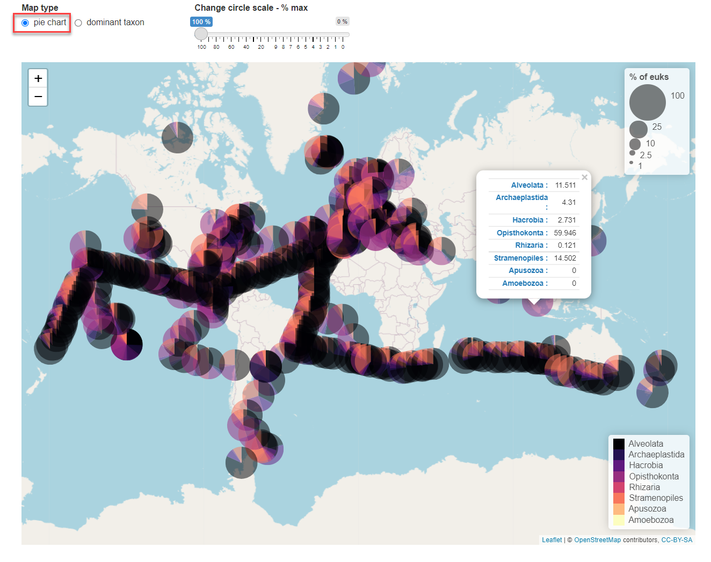
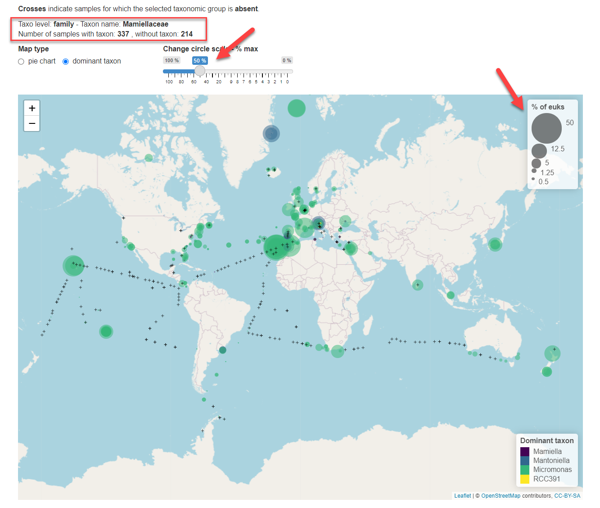

```{r, include = FALSE}
knitr::opts_chunk$set(
  collapse = TRUE,
  cache = FALSE,
  warning = FALSE,
  message = FALSE,
  prompt=FALSE,
  tidy=FALSE,
  comment = "#>" 
#  fig.path = "img/"   # Directories where image are saved
)

# Notes
# - cannot use rmarkdown::html_vignette for the moment (maybe with R version 4.0)
# - use devtools::build_vignettes() to build the vignettes
# - need to build source package to have the vignettes
```

## Overview

Reads are expressed as % relative to total eukaryotes.  The taxa shown are below the level selected.  For example if you select division, the different classes within this division will be shown (see Fig. 3).

**Crosses** indicate samples for which the selected taxonomic group is **absent**.

The map panel offers 2 different views:

* Dominant taxon: The color of the circles represent the dominant taxon.  If you click on the circle the contribution of the taxonomic group selected is provided with some information on the sample (Fig. 1)

* Pie chart: The different taxon at the next rank are represented.  Click on the pie chart will provide the % contribution of each group below the taxonomic level selected (Fig. 2)

Reads are expressed as % relative to total eukaryotes.  The taxa shown are below the level selected.  For example if you select division, the different classes within this division will be shown.

**Crosses** indicate samples for which the selected taxonomic group is **absent**.

<br />
<br />
```{r echo=FALSE, out.width="100%", fig.cap="Fig.1: Map panel indpminant taxon mode."}

```
<br />
<br />
```{r echo=FALSE, out.width="100%", fig.cap="Fig.1: Map panel in pie chart mode."}

```


The total number of stations with and without the taxon present are indicated above the map (Fig. 3, red rectangle). The size of the circle can be changed by moving the cursor above the map.  This is expressed as % of total eukaryotic reads.

<br />
<br />
```{r echo=FALSE, out.width="100%", fig.cap="Fig.3: Taxonomic level selected is family. Size of circles has been increased to represent 50% of total eukaryotic reads maximum."}

```