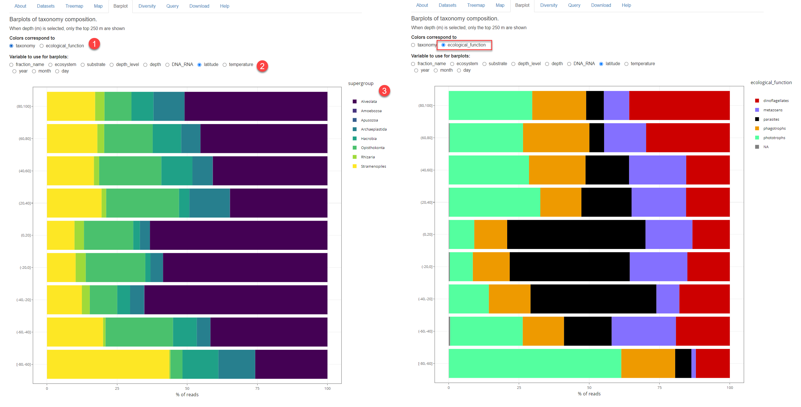
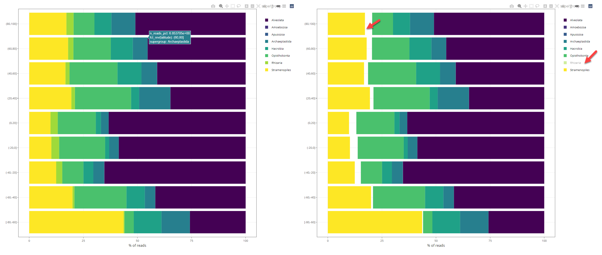
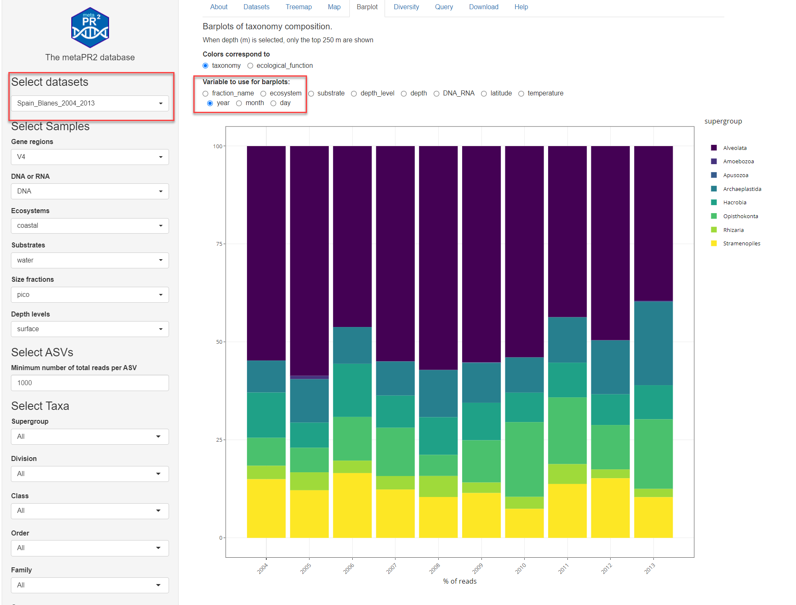
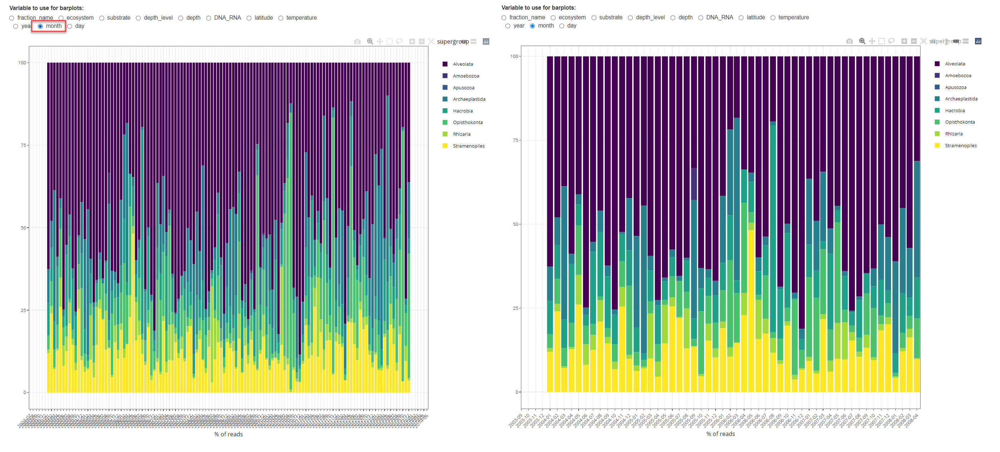

```{r, include = FALSE}
knitr::opts_chunk$set(
  collapse = TRUE,
  cache = FALSE,
  warning = FALSE,
  message = FALSE,
  prompt=FALSE,
  tidy=FALSE,
  comment = "#>" 
#  fig.path = "img/"   # Directories where image are saved
)

# Notes
# - cannot use rmarkdown::html_vignette for the moment (maybe with R version 4.0)
# - use devtools::build_vignettes() to build the vignettes
# - need to build source package to have the vignettes
```

The barplot panel allow to produce barplots using a variety of metadata (Fig. 1). As for the other panels this will only apply to the datasets, samples, ASV and taxa selected.  Two major settings can be used:

* Color according to taxonomy or according to ecological function (Fig. 1).  Ecological function is according the list from Sommeria-Klein et al. (2021) as appears in their Supplementary material.

* Variable to use
  * fraction name
  * ecosystem
  * substrate
  * depth (in m) and depth_level
  * DNA_RNA
  * latitude
  * temperature
  * salinity
  * date (see below)

<br />
<br />
```{r bar-01, echo=FALSE, out.width="100%", fig.cap="Fig. 1: Barplot with taxonomy. 1: Color accoding to taxonomy of ecological function. 2: Variable to use. 3: Barplot. Left: Using taxonomy Right: using ecological function"}

```
<br />
<br />
## Interactive plots
Plots are interactive and there is a menu on the upper right (Fig. 2). In particular you can isolate a specific taxonomic group by clicking on the group (Fig. 4).
<br />
<br />
```{r echo=FALSE, out.width="100%", fig.cap="Fig. 2: Barplot interactive. Right:  isolating a specific group."}

```
<br />
<br />

## Time series
Time series can also be plotted with data aggregated by:

* year (Fig. 3)
* month (Fig. 4)
* day

To test this feature it is best to use a single dataset (e.g. Spanish Blanes from Giner et al. 2019) and to use a single size fraction. Using the zoom function of plotly, one can more easily display monthly and daily data (Fig. 4).

<br />
<br />
```{r echo=FALSE, out.width="80%", fig.cap="Fig. 3: Barplot time series with year aggregation"}

```
<br />
<br />
```{r echo=FALSE, out.width="100%", fig.cap="Fig. 4: Barplot time series with month aggregation. Right: after zooming"}

```
<br />
<br />

## References

* Sommeria-Klein, G., Watteaux, R., Ibarbalz, F.M., Pierella Karlusich, J.J., Iudicone, D., Bowler, C., Morlon, H., 2021. Global drivers of eukaryotic plankton biogeography in the sunlit ocean. Science 374, 594–599. https://doi.org/10.1126/science.abb3717

* Giner, C.R., Balagué, V., Krabberød, A.K., Ferrera, I., Reñé, A., Garcés, E., Gasol, J.M., Logares, R., Massana, R., 2019. Quantifying long-term recurrence in planktonic microbial eukaryotes. Molecular Ecology 28, 923–935. https://doi.org/10.1111/mec.14929

