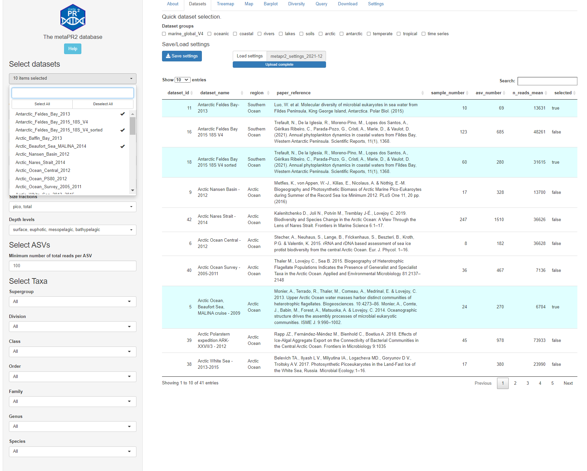
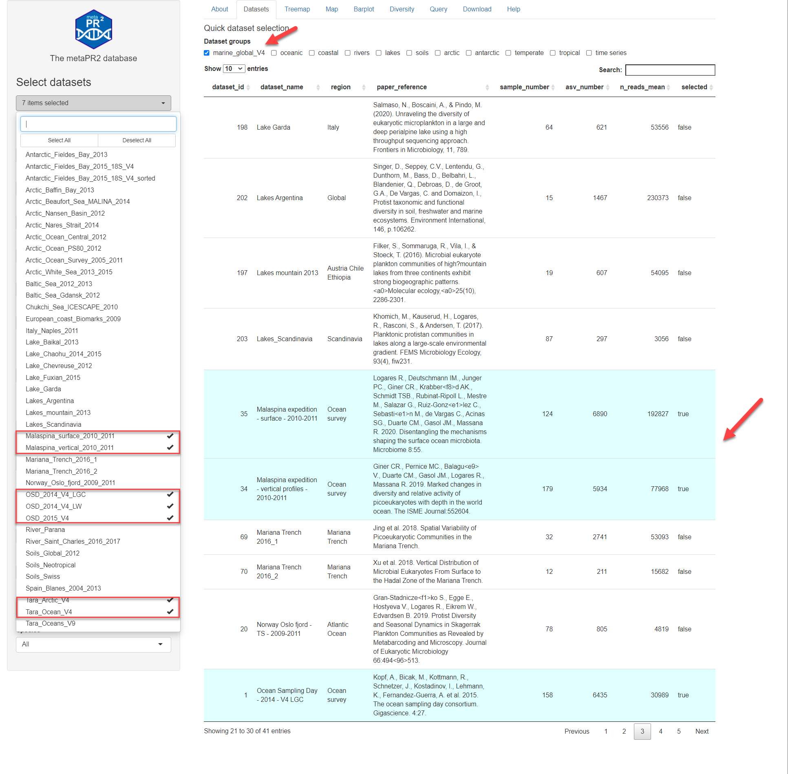

```{r, include = FALSE}
knitr::opts_chunk$set(
  collapse = TRUE,
  cache = FALSE,
  warning = FALSE,
  message = FALSE,
  prompt=FALSE,
  tidy=FALSE,
  comment = "#>" 
#  fig.path = "img/"   # Directories where image are saved
)

# Notes
# - cannot use rmarkdown::html_vignette for the moment (maybe with R version 4.0)
# - use devtools::build_vignettes() to build the vignettes
# - need to build source package to have the vignettes
```

## Overview

This page (Fig. 1) lists all the datasets included in the database (41 for the current version)  with basic information (reference, number of samples, mean number of reads).  Datasets can be selected using the left panel but there is also a quick way to select datasets from specific environments or time series (Fig. 2). It is possible to save the settings (dataset selected, gene region, DNA/RNA etc...) in a simple text file ([yaml](https://en.wikipedia.org/wiki/YAML)) that can edited/reloaded.

<br />
<br />
```{r echo=FALSE, out.width="100%", fig.cap="Fig.1: Datasets."}

```
<br />
<br />
```{r echo=FALSE, out.width="100%", fig.cap="Fig. 2: Quick selection of datasets (top arrow)."}

```


### Example of YAML file

```{yaml}
gene_region: V4
DNA_RNA: DNA
ecosystem:
- oceanic
- coastal
substrate: water
fraction_name:
- pico
- total
depth_level:
- surface
- euphotic
- mesopelagic
- bathypelagic
datasets_selected_id:
- '35'
- '34'
- '1'
- '3'
- '2'
- '206'
- '205'
reads_min: 100
```

