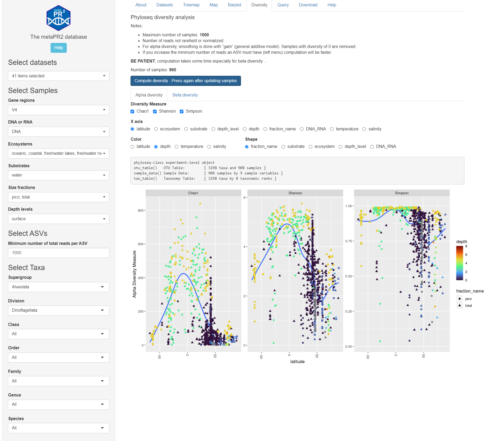
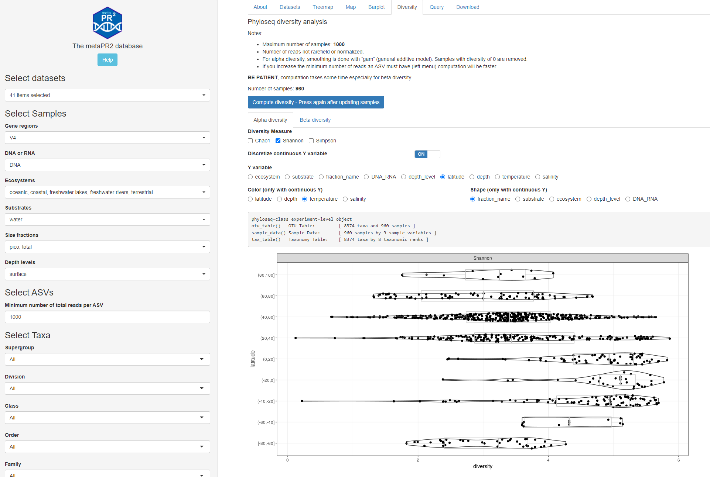
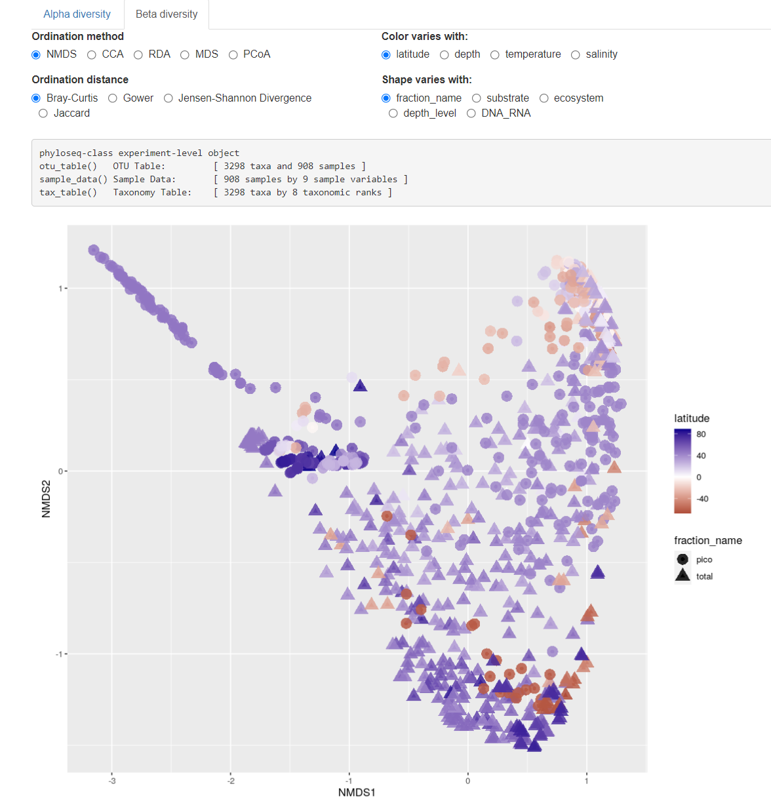
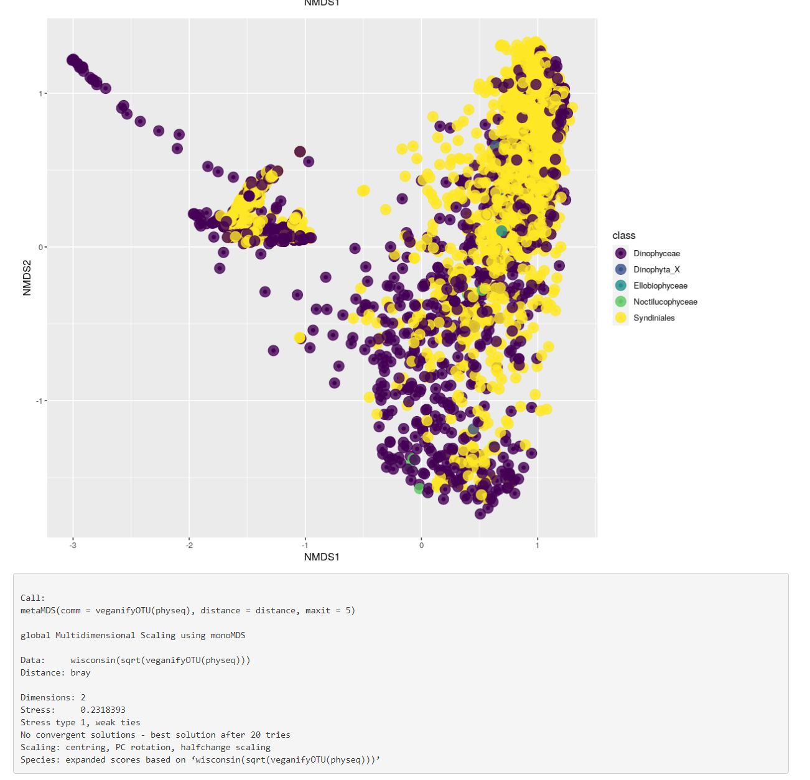

```{r, include = FALSE}
knitr::opts_chunk$set(
  collapse = TRUE,
  cache = FALSE,
  warning = FALSE,
  message = FALSE,
  prompt=FALSE,
  tidy=FALSE,
  comment = "#>" 
#  fig.path = "img/"   # Directories where image are saved
)

# Notes
# - cannot use rmarkdown::html_vignette for the moment (maybe with R version 4.0)
# - use devtools::build_vignettes() to build the vignettes
# - need to build source package to have the vignettes
```

Alpha and beta diversity are performed using the phyloseq package (McMurdie and Holmes, 2013).

* Because of the time and resources that are used for these computations, the maximum number of samples possible is **1000**. If you have more samples, you will need to deselect some datasets or groups of samples.
* Number of reads not rarefield or normalized. 
* For alpha diversity, smoothing is done with "gam" (general additive model). Samples with diversity of 0 are removed.
* If you increase the minimum number of reads an ASV must have (left menu) computation will be faster.

In order to start the computation, press on the button which will build the phyloseq file from the selected data.

**BE PATIENT**, computation takes some time especially for beta diversity... 

<br />
<br />

## Alpha diversity

You can:

* compute different indices and display as violin plot when using a discrete variable for y-axis.
* Change the y axis.  If you choose a continuous variable (depth, latitude, temperature, salinity), you can choose to discretize it in intervals.
* Change the color of points (continuous variables)
* Change the shape of points (discrete variables)


```{r echo=FALSE, out.width="100%", fig.cap="Fig. 1A: Alpha diversity: continuous y axis"}

```
<br />
<br />
```{r echo=FALSE, out.width="100%", fig.cap="Fig. 1B: Alpha diversity: discrete y-axis"}

```

## Beta diversity

You can:

* Use different methods and distances
* Change the x axis
* Change the color of points (continuous variables)
* Change the shape of points (discrete variables)


```{r echo=FALSE, out.width="100%", fig.cap="Fig. 2: Beta diversity samples."}

```
<br />
<br />

```{r echo=FALSE, out.width="100%", fig.cap="Fig. 3: Bata diversity taxa and phyloseq object structure."}

```
<br />
<br />

## References

* McMurdie, P.J., Holmes, S., 2013. Phyloseq: An R Package for Reproducible Interactive Analysis and Graphics of Microbiome Census Data. PLoS ONE 8, e61217. https://doi.org/10.1371/journal.pone.0061217
