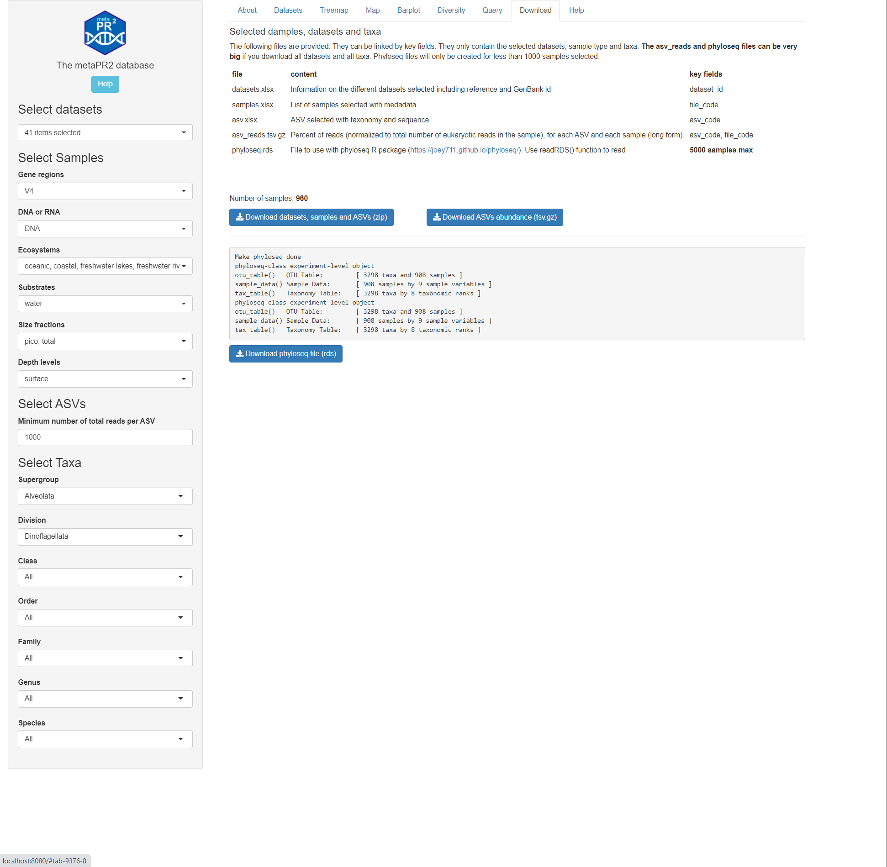

```{r, include = FALSE}
knitr::opts_chunk$set(
  collapse = TRUE,
  cache = FALSE,
  warning = FALSE,
  message = FALSE,
  prompt=FALSE,
  tidy=FALSE,
  comment = "#>" 
#  fig.path = "img/"   # Directories where image are saved
)

# Notes
# - cannot use rmarkdown::html_vignette for the moment (maybe with R version 4.0)
# - use devtools::build_vignettes() to build the vignettes
# - need to build source package to have the vignettes
```

## Overview

This panel allows to download the processed data.  The following files are provided.  They can be linked by key fields.  They only contain the selected datasets, sample type and taxa. 

**The asv_reads and phyloseq files can be very big** if you download all datasets and all taxa.


<br />
<br />

file | content | key fields
--- | --- | ---
datasets.xlsx | Information on the different datasets selected including reference and GenBank id | dataset_id
samples.xlsx | List of samples selected with medadata | file_code
asv.xlsx | ASV selected with taxonomy and sequence | asv_code
asv_reads.tsv.gz | Percent of reads (normalized to total number of eukaryotic reads in the sample), for each ASV and each sample (long form). | asv_code, file_code
phyloseq.rds | File to use with phyloseq R package (https://joey711.github.io/phyloseq/). Use readRDS() function to read | **5000 samples max**

<br />
<br />

```{r echo=FALSE, out.width="100%", fig.cap="Fig. 1: Download page"}

```
