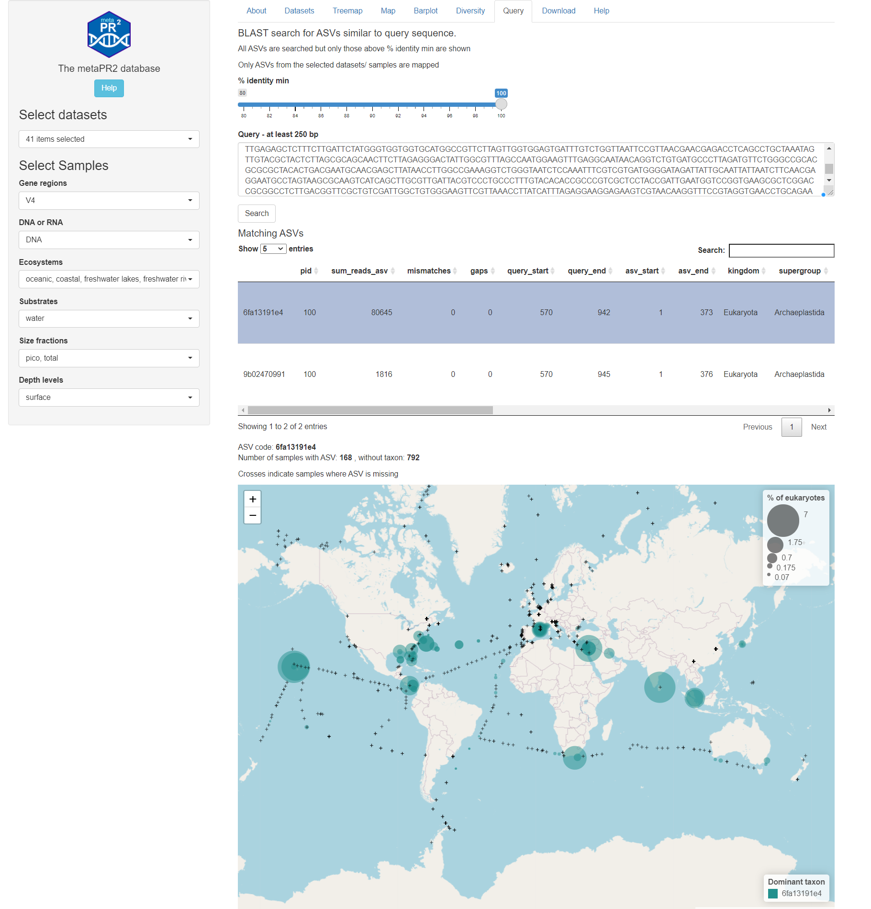
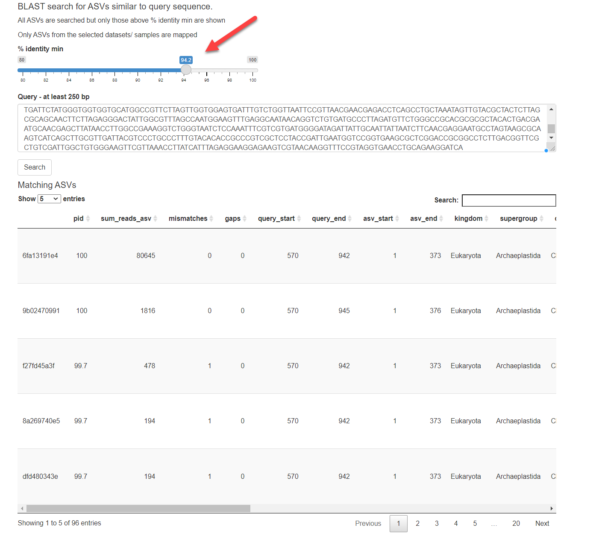

```{r, include = FALSE}
knitr::opts_chunk$set(
  collapse = TRUE,
  cache = FALSE,
  warning = FALSE,
  message = FALSE,
  prompt=FALSE,
  tidy=FALSE,
  comment = "#>" 
#  fig.path = "img/"   # Directories where image are saved
)

# Notes
# - cannot use rmarkdown::html_vignette for the moment (maybe with R version 4.0)
# - use devtools::build_vignettes() to build the vignettes
# - need to build source package to have the vignettes
```

This panel allows to query the ASVs in the database. Enter your sequence (only the sequence, do not include the fasta header) and press the `Search`button. All ASVs in the database are searched (not only those from teh selected datasets or samples).  By clicking a sequence in the ASV table (Fig. 1) you can display the distribution of this ASV in the samples selected.  

You can change the number of sequences displayed by decreasing the similarity threshold (Fig. 2).


<br />
<br />
```{r echo=FALSE, out.width="100%", fig.cap="Fig. 1: Query page with map of selected ASV"}

```

<br />
<br />
```{r echo=FALSE, out.width="100%", fig.cap="Fig. 2: Query page after decreasing the similarity threshold."}

```
<br />
<br />

## Test sequence

You can use the sequence below (from _Micromonas_) to test this functionality.

```

ACCTGGTTGATCCTGCCAGTAGTCATATGCTTGTCTCAAAGATTAAGCCATGCATGTCTAAGTATAAGCGTTATACTGTGAAACTGCGAATGGCTCATTAAATCAGCAATAGTTTCTTTGGTGGTGTTTACTACATGGATAACCGTAGTAATTCTAGAGCTAATACATGCGTAAATCCCGACTTCGGAAGGGACGTATTTATTAGATAAAGACCGACCTCGTTCTGCGGTGAATCATGATAACTTCACGGACCGCATGGCCTCGCGCCGGCGGTGTTCCATTCAAATTTCTGCCCTATCAACTTTCGACGGTAGGATAGAGGCCTACCGTGGTGTTCACGGGTGACGGAGAATTAGGGTTCGATTCCGGAGAGGGAGCCTGAGAAACGGCTACCACATCCAAGGAAGGCAGCAGGCGCGCAAATTACCCAATCCTGACACAGGGAGGTAGTGACAATAAATAACAATATCGGGGTTTTTCAACTCTGATAATTGGAATGAGAACAATCTAAATCCCTTAACGAGGATCCATTGGAGGGCAAGTCTGGTGCCAGCAGCCGCGGTAATTCCAGCTCCAATAGCGTATATTTAAGTTGTTGCAGTTAAAAAGCTCGTAGTTGGATTTCGGTTAAGAGCGACCGGTCCGCCGTTTGGTGTGCACTGGTTGGTTTTAACTTCCTGTAGAGGACGTGCTCTGGGTTTAACGACCTGGACTCGGAGTCTACGTGGTTACTTTGAAAAAATTAGAGTGTTCAAAGCGGGCTTACGCTTGAATATTTCAGCATGGAATAACACTATAGGACTCCTGTCCTATTTCGTTGGTCTCGGGACGGGAGTAATGATTAAGAGGAACAGTTGGGGGCATTCGTATTTCATTGTCAGAGGTGAAATTCTTGGATTTATGAAAGACGAACTTCTGCGAAAGCATTTGCCAAGGATGTTTTCATTAATCAAGAACGAAAGTTGGGGGCTCGAAGATGATTAGATACCATCCTAGTCTCAACCATAAACGATGCCGACTAGGGATTGGCGGATGTTAATTGATGACTCCGCCAGCACCTTATGAGAAATCAAAGTTTTTGGGTTCCGGGGGGAGTATGGTCGCAAGGCTGAAACTTAAAGGAATTGACGGAAGGGCACCACCAGGCGTGGAGCCTGCGGCTTAATTTGACTCAACACGGGAAAACTTACCAGGTCCAGACATAGTAAGGATTGACAGATTGAGAGCTCTTTCTTGATTCTATGGGTGGTGGTGCATGGCCGTTCTTAGTTGGTGGAGTGATTTGTCTGGTTAATTCCGTTAACGAACGAGACCTCAGCCTGCTAAATAGTTGTACGCTACTCTTAGCGCAGCAACTTCTTAGAGGGACTATTGGCGTTTAGCCAATGGAAGTTTGAGGCAATAACAGGTCTGTGATGCCCTTAGATGTTCTGGGCCGCACGCGCGCTACACTGACGAATGCAACGAGCTTATAACCTTGGCCGAAAGGTCTGGGTAATCTCCAAATTTCGTCGTGATGGGGATAGATTATTGCAATTATTAATCTTCAACGAGGAATGCCTAGTAAGCGCAAGTCATCAGCTTGCGTTGATTACGTCCCTGCCCTTTGTACACACCGCCCGTCGCTCCTACCGATTGAATGGTCCGGTGAAGCGCTCGGACCGCGGCCTCTTGACGGTTCGCTGTCGATTGGCTGTGGGAAGTTCGTTAAACCTTATCATTTAGAGGAAGGAGAAGTCGTAACAAGGTTTCCGTAGGTGAACCTGCAGAAGGATCA

```


