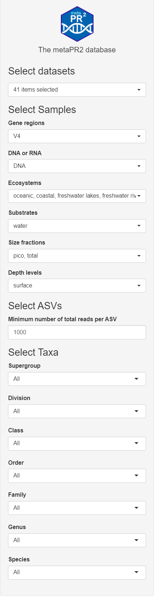

```{r, include = FALSE}
knitr::opts_chunk$set(
  collapse = TRUE,
  cache = FALSE,
  warning = FALSE,
  message = FALSE,
  prompt=FALSE,
  tidy=FALSE,
  comment = "#>" 
#  fig.path = "img/"   # Directories where image are saved
)

# Notes
# - cannot use rmarkdown::html_vignette for the moment (maybe with R version 4.0)
# - use devtools::build_vignettes() to build the vignettes
# - need to build source package to have the vignettes
```

This panel allows to select the data analyzed according to a variety of criteria. When the application is started a number of defaults values are selected to limit the number of samples.

### Select datasets, samples and ASVs

Select | Choices | Default
--- | --- | ---  
**Datasets** | Access through panel "Datasets". | All
**Samples** | 
DNA_RNA | DNA or RNA | DNA
ecosystems | oceanic, coastal, freshwater etc ... | All
substrates | water, ice, soil etc... | water
fraction | pico 0.2-3 µm / nano 3-20 µm / micro 20-100 µm   / meso 100-1000 µm / total 0.2-100 or 200 µm | pico, total
Depth levels | surface (0-10 m), euphotic (10-250 m), bathypelagic (250-1000 m), bathypelagic (> 1000 m) | surface
**Minimum number of reads per ASV** | 100-10,000 - If you increase this number the number of ASVs will decrease. | 100

<br />
<br />
```{r echo=FALSE, out.width="40%", fig.cap="Fig. 1: Selection menu."}
# 

htmltools::img(src = "img/select_01.png", 
               style = 'position:relative; left:50px; top:0px; padding:10px;',
               width = "300px")
htmltools::img(src = "img/select_02.png", 
               style = 'position:relative; left:50px; top:0px; padding:10px;',
               width = "300px")
```
<br />
<br />

### Select taxonomy

It is possible at each level (supergroup, division, class, order, family, genus, species, asv_code) to select 1 or more groups.  In order to update the plots, you need to press the **Validate** button.  You can also completely reset the taxonomy selection using the **Reset** button.  It is possible to save and reload the choices made.  The taxonomy is saved as a ([yaml](https://en.wikipedia.org/wiki/YAML)) file.


#### Yaml taxonomy file

```{yaml}
level: asv_code
name:
- ec4282114f
- edef1142c8
- 8b130de34f
supergroup: Archaeplastida
division: Chlorophyta
class: Mamiellophyceae
order: Mamiellales
family: Mamiellaceae
genus: Micromonas
species: Micromonas_polaris
asv_code:
- ec4282114f
- edef1142c8
- 8b130de34f
taxa_excluded: Streptophyta

```

