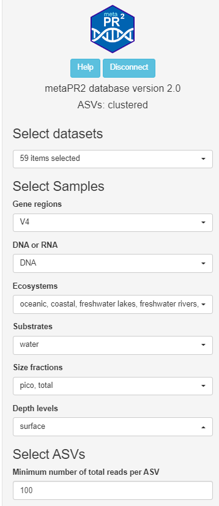

```{r, include = FALSE}
knitr::opts_chunk$set(
  collapse = TRUE,
  cache = FALSE,
  warning = FALSE,
  message = FALSE,
  prompt=FALSE,
  tidy=FALSE,
  comment = "#>" 
#  fig.path = "img/"   # Directories where image are saved
)

# Notes
# - cannot use rmarkdown::html_vignette for the moment (maybe with R version 4.0)
# - use devtools::build_vignettes() to build the vignettes
# - need to build source package to have the vignettes
```

## Overview

This panel allows to select the data analyzed according to a variety of criteria.


Select | Choices 
--- | --- 
**Datasets** | Access through panel "Datasets". 
**Samples** | 
DNA_RNA | DNA or RNA
ecosystems | oceanic, coastal, freshwater etc ...
substrates | water, ice, soil etc...
fraction | pico 0.2-3 µm / nano 3-20 µm / micro 20-100 µm   / meso 100-1000 µm / total 0.2-100 or 200 µm
Depth levels | surface (0-10 m), euphotic (10-250 m), bathypelagic (250-1000 m), bathypelagic (> 1000 m)
**Minimum number of reads per ASV** | 100-10,000 - If you increase this number the number of ASVs will decrease.
**Taxa** | supergroup, division, class, order, family, genus, species

<br />
<br />
```{r echo=FALSE, out.width="40%", fig.cap="Fig. 1: Selection menu."}
# 

htmltools::img(src = "img/select_01.png", 
               style = 'position:relative; left:300px; top:0px; padding:10px;',
               width = "300px")
```
<br />
<br />


