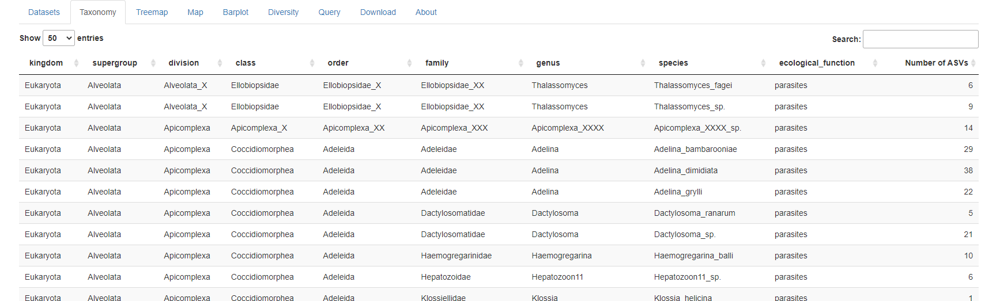
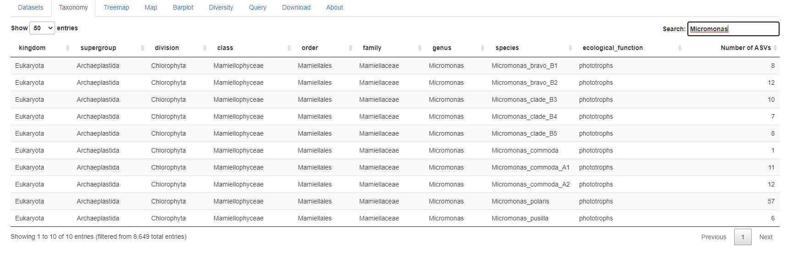

```{r, include = FALSE}
knitr::opts_chunk$set(
  collapse = TRUE,
  cache = FALSE,
  warning = FALSE,
  message = FALSE,
  prompt=FALSE,
  tidy=FALSE,
  comment = "#>" 
#  fig.path = "img/"   # Directories where image are saved
)

# Notes
# - cannot use rmarkdown::html_vignette for the moment (maybe with R version 4.0)
# - use devtools::build_vignettes() to build the vignettes
# - need to build source package to have the vignettes
```


This page (Fig. 1) lists all the taxa included in the current database down to the species level  with the number of ASVs for each species.  It is possible to search and filter the taxble for any taxonomic name (Fig. 2).

<br />
<br />
```{r echo=FALSE, out.width="100%", fig.cap="Fig.1: Taxa included in the database."}

```
<br />
<br />
```{r echo=FALSE, out.width="100%", fig.cap="Fig. 2: Taxa filtered based on genus name."}

```
