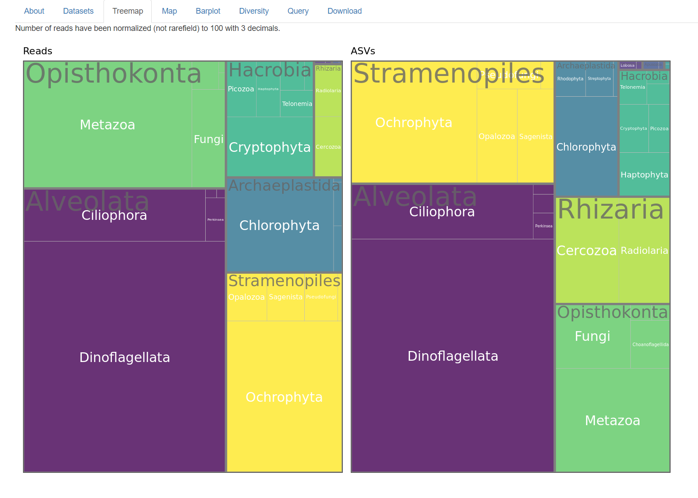

```{r, include = FALSE}
knitr::opts_chunk$set(
  collapse = TRUE,
  cache = FALSE,
  warning = FALSE,
  message = FALSE,
  prompt=FALSE,
  tidy=FALSE,
  comment = "#>" 
#  fig.path = "img/"   # Directories where image are saved
)

# Notes
# - cannot use rmarkdown::html_vignette for the moment (maybe with R version 4.0)
# - use devtools::build_vignettes() to build the vignettes
# - need to build source package to have the vignettes
```

This panel shows a treemap both in terms of read numbers (left) and of number of ASVs (right).

Total read number per sample has been normalized to 100 with 3 decimals so that the value displayed in the different panels on the left size correspond to % of total eukaryotic reads.

<br />
<br />
```{r echo=FALSE, out.width="100%", fig.cap="Fig.1: Treeemap."}

```
